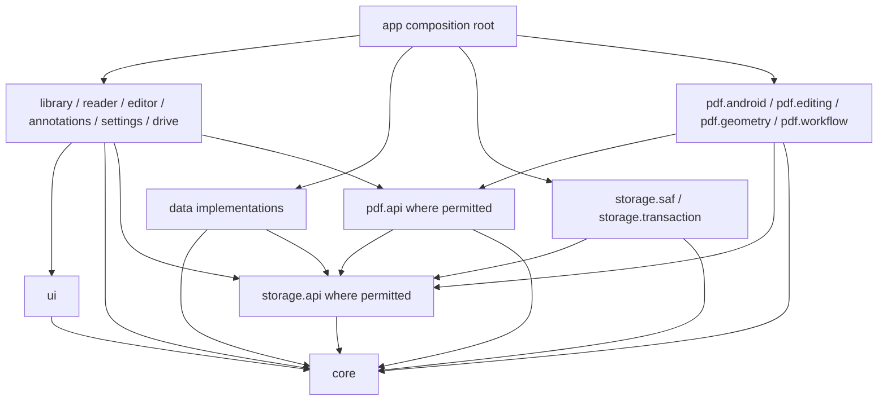
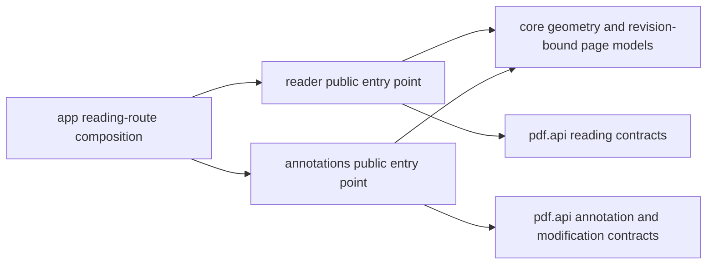

# PartiturasPDF initial architecture — A0

## Status and authority

**Approved design direction; future implementation.** A0 consolidates the owner's
architecture decisions in documentation. It does not implement the components or
authorize A1, dependencies, product development or integration. The owner must
review this PR and personally perform any merge.

At the audited base `ffdb35c9d9b0b4c55c94ce4783019e875c52278f`, Phase 0 and
its status cleanup are merged (PRs #1–#4). The application contains only
`MainActivity`, a resource-backed greeting and `ui/theme`; it has no library,
reader, editor, annotation, persistence, navigation or Drive implementation.
The existing unit and instrumentation tests verify the starter foundation.
Phase 0 compatibility evidence is recorded in [CI.md](../CI.md), including actual
API 26/27/36 tests at the stated historical revision. Those results do not verify
the future architecture described here.

Binding requirements remain in [AGENTS.md](../../AGENTS.md),
[PROJECT_SPECIFICATION.md](../PROJECT_SPECIFICATION.md),
[TESTING_POLICY.md](../TESTING_POLICY.md),
[CHANGE_CONTROL.md](../CHANGE_CONTROL.md) and
[DEFINITION_OF_DONE.md](../DEFINITION_OF_DONE.md). This design refines their
future package plan without changing product requirements or governance. No
material conflict was found during the A0 audit. Names and ownership are defined
once in [CONTRACTS.md](CONTRACTS.md); implementation sequencing and approval
boundaries are in [DEVELOPMENT_PLAN.md](DEVELOPMENT_PLAN.md).

## Principles and constraints

- KISS and DRY: share coordinate mathematics, identity and publication semantics;
  keep feature-specific presentation local. Do not introduce a generic utility
  object containing unrelated responsibilities.
- High cohesion and low coupling: each component owns a clear capability and
  consumes public contracts. Use SOLID where replacing a renderer, testing a
  provider or isolating persistence provides concrete value.
- Prefer composition over inheritance. Introduce interfaces at engine, provider,
  persistence and coordinated operation boundaries, rather than for every class.
- One Android Gradle module, `:app`; packages express logical boundaries. No
  factories, abstract base ViewModels, mandatory DI framework or speculative
  repositories/layers. Create packages only when approved code uses them.
- Offline-first: local reading/editing never requires Drive, an account, network,
  analytics, a backend or a global EventBus.
- PDF-first: user-accessible PDFs are authoritative content. Metadata and private
  working copies support them; neither becomes a proprietary replacement library.
- Data safety: immutable input snapshots, private working copies, validated
  complete output and controlled publication. Start with safe SaveAs.
- API 26 remains mandatory. Keep `com.abdev.partituraspdf`, Kotlin, Compose,
  Material 3, brand colors `#A5D6A7`/`#90CAF9`, accessible light/dark tablet UI and
  English fallback/Catalan/Spanish resource contracts.
- Preserve the current toolchain and dependencies. [TECH_STACK.md](../TECH_STACK.md)
  records AGP 9.4.1, wrapper 9.8.0, compile/target 37, Compose compiler 2.2.10,
  BOM 2026.02.01, Java source/target 11 and daemon JDK 25. Those are separate from
  Android runtime compatibility. Room, DataStore and PDF editing/Drive libraries
  remain prospective dependencies, requiring separate approved evaluation.

## Logical components

| Component | Owns | Does not own |
| --- | --- | --- |
| `app` | Startup, navigation, dependency composition, lifetimes and controlled feature integration | PDF algorithms, provider implementation or database queries |
| `library` | Browsing folders/documents, search, favorites and orchestration of approved library operations | SAF mechanics, authoritative document identity or Room entities |
| `reader` | Reading session lifetime, page navigation, zoom, viewport and bounded rendering cache | Concrete renderer, persisted annotation writing or another feature's ViewModel |
| `editor` | Editing state and ordered page-composition intent | Direct PDFBox manipulation or destination writes |
| `annotations` | Tools, recoverable drafts, reversible commands, undo/redo and overlay presentation | Render-engine internals or independent save transaction logic |
| `settings` | Preference presentation and future language/appearance selection | DataStore implementation or platform-only locale assumptions |
| `drive` | Optional consent-based import/export and remote transfer adapters | Mandatory local storage, automatic synchronization or authorization secrets in preferences |
| `core` | Android-free domain models, identifiers, contracts, typed errors and PDF coordinate mathematics | Compose, Android handles, SAF implementations, PDF engines, Room or DataStore |
| `storage` | SAF adapters, permission/access handling, snapshot materialization, temporary files, recovery artifacts and safe publication | Metadata database, PDF parsing or feature state |
| `pdf` | Public PDF operations, rendering/editing adapters, exact geometry inspection, output validation and modification workflow | SAF provider internals, UI or durable metadata implementation |
| `data` | Implementations of document registry, metadata/preferences repositories and private draft persistence | Authoritative PDF content, rendering or direct feature interactions |
| `ui` | Shared theme and reusable Compose visual primitives | Individual feature state, navigation, repositories or engines |

These are twelve logical components, not twelve Gradle modules. The logical
`app` package is distinct from the existing Gradle `:app` module.

## Conceptual package layout

The following is a future layout under `com.abdev.partituraspdf`. A0 creates no
source packages and does not move the existing starter Activity or theme.

```text
com.abdev.partituraspdf/
  app/
    navigation/
    di/
  library/
  reader/
  editor/
  annotations/
  settings/
  drive/
  core/
    document/
    geometry/
    annotation/
    preferences/
    result/
  storage/
    api/
    saf/
    transaction/
  pdf/
    api/
    android/
    editing/
    geometry/
    workflow/
  data/
    metadata/
    preferences/
  ui/
    theme/
    components/
```

`app/di` means explicit constructor wiring and lifetime composition; it does not
require a DI dependency. Feature-internal subpackages are created only as needed.
`pdf/geometry` adapts exact PDF inspection; pure transformations belong in
`core/geometry`. `storage/transaction` owns publication and recovery artifacts;
`pdf/workflow` owns PDF modification coordination. These are different duties.

## Allowed dependencies

An entry below grants access only to that column's **public contracts**. `impl`
access is reserved for composition and each implementation's own internal
collaborators. Unlisted imports are forbidden; transitive access is not granted.
Platform/lifecycle/coroutine dependencies within the owning adapter or feature
still require approved dependency introduction.

| Importing component | `core` | `ui` | `storage.api` | `pdf.api` | `data` implementation | `storage` implementation | `pdf` implementation | Other features |
| --- | --- | --- | --- | --- | --- | --- | --- | --- |
| `core` | Internal only | No | No | No | No | No | No | No |
| `ui` | Yes, presentation inputs only | Internal only | No | No | No | No | No | No |
| `storage.api` | Yes | No | Internal only | No | No | No | No | No |
| `storage.saf`, `storage.transaction` | Yes | No | Yes | No | No | Own internals | No | No |
| `pdf.api` | Yes | No | Yes | Internal only | No | No | No | No |
| `pdf.android`, `pdf.editing`, `pdf.geometry` | Yes | No | Yes | Yes | No | No | Own internals | No |
| `pdf.workflow` | Yes | No | Yes | Yes | No | No | Own internal workflow helpers | No |
| `data` | Yes | No | Yes, private draft/recovery access only | No | Own internals | No | No | No |
| `library` | Yes | Yes | Yes, required library access only | No | No | No | No | No |
| `reader` | Yes | Yes | Yes, read/snapshot access only | Yes, reading/geometry only | No | No | No | No |
| `editor`, `annotations` | Yes | Yes | Yes, snapshot/publication/draft capabilities only | Yes, required inspection/modification contracts | No | No | No | No |
| `settings` | Yes | Yes | No | No | No | No | No | No |
| `drive` | Yes | Yes | Yes, approved import/export access only | No | No | No | No | No |
| `app` | Yes | Yes | Yes | Yes | Composition only | Composition only | Composition only | Public entry points for composition |

Repository interfaces (`DocumentRegistry`, `DocumentMetadataRepository`,
`PreferencesRepository`, `AnnotationDraftStore`) live in `core`; features do not
import `data` to consume them. `DocumentCatalog` is a core contract implemented
by storage; it describes physical browsing independently of registry persistence.
Storage never imports data. Data can use the storage contract for private draft
files without creating the reverse edge. PDF workflow receives core repository
interfaces and engine/storage contracts through constructors, without instantiating
adapters. A renderer never acquires a concrete SAF implementation.

The diagram uses arrows from **consumer to dependency**. Repeated feature
capabilities are grouped only for readability; the matrix is authoritative.



The dependency order is `core`, then `ui`/`storage.api`, then `pdf.api`/data and
storage adapters, then PDF adapters/workflow, features and finally composition.
No core or adapter dependency points back to a feature or the composition root.

Within one Gradle module, Kotlin `internal` is module-wide and cannot enforce
these package restrictions. Future approved implementation must use import and
fully qualified reference review, public-surface review, and meaningful
architecture checks when warranted. Do not claim compiler-enforced isolation or
add an architecture-testing dependency during A0. Tests may access their subject's
internals without establishing a production cross-component dependency.

## Composition and feature interaction

`app` constructs implementations and injects contracts with explicit lifetime
ownership. It assembles a navigation graph only when approved, passes
`DocumentId` and small reconstructible parameters across destinations, and
resolves current access via `DocumentRegistry`. It never passes a live PDF
session, bitmap, Room entity or PDFBox object as a navigation argument.

Each feature owns its Compose route, ViewModel and immutable UI state. Actions
enter the ViewModel; `StateFlow`/`Flow` exposes state; UI collects with an
appropriate lifecycle. Repositories provide durable observations, services
coordinate substantial reusable work, and coroutine scopes follow their owner.
Small functions remain functions; do not require a use-case class per button.
`SavedStateHandle` contains IDs, page indices and small reconstructible UI state,
not document bytes, bitmaps, complete annotations or an undo history. Room,
DataStore and private recoverable drafts address different persistence needs.

### Reader and Annotations

Reader exports a public composition entry point accepting viewport/overlay
content and narrow callbacks. Annotations exports its own public entry point
accepting a revision-bound page, exact geometry, a shared transform, draft state
and tool events. `app` hosts both, mediates their inputs and chooses the current
interaction mode. Neither imports the other's ViewModel or implementation.
The integration holder in `app` belongs to the reading route; it is not a global
state singleton or EventBus.



Both presentations consume the same revision-consistent transform, including
crop origin, page rotation, UserUnit, fit scale, zoom and pan. Unknown exact
geometry may permit safe read-only viewing but disables annotation editing.
Pointer arbitration disables page-turn gestures while drawing/selecting;
scroll/zoom/tool priorities require tablet tests. Persisted annotations, draft
overlays and renderer-baked appearances are reconciled by a declared rendering
policy so an annotation is not painted twice. Any unsupported annotation or
appearance behavior is reported explicitly, rather than silently flattened.

## Data ownership and safety

| Data | Authority and lifetime |
| --- | --- |
| PDF bytes and persisted standard annotations | User document/provider; source remains untouched during processing |
| Logical document identity and access associations | `DocumentRegistry` implemented by data; URI/location can change without necessarily changing identity |
| Display/provider information | `DocumentCatalog`; observations may be stale and are not content-revision proof |
| Favorites, reading position and library index | `DocumentMetadataRepository`/Room; reconciled with the current document revision |
| Typed application/reader preferences | `PreferencesRepository`/DataStore; never authorization tokens |
| Exact PDF geometry | Inspection of the exact snapshot revision; shared pure models and mathematics in core |
| Rendered pages | Reader's bounded cache plus explicitly owned render leases; transient, never durable PDF content |
| Unsaved annotation work | Annotations owns intent/history; `AnnotationDraftStore` persists revision-bound recoverable drafts in private storage |
| Working snapshots, validated output and recovery copies | Operation-owned private storage; recoverable transaction records retained when publication/reconciliation is uncertain |
| Remote Drive files and grants | Explicit remote IDs/consent in drive; no filename-based identity or mandatory synchronization |

Inaccessible, missing, revoked and changed are distinct states. A failed query
does not prove deletion. Same-name or same-byte documents are not automatically
one logical document. Reconciliation must confirm identity before relocating or
reattaching metadata/drafts. Room never makes a stale row authoritative over PDF
content. Post-publication metadata failure is tracked as pending reconciliation,
not silently retried as another destructive write.

Safe modifications share one `PdfModificationService` workflow defined in
[CONTRACTS.md](CONTRACTS.md): snapshot, modify privately, validate the complete
artifact, publish, reconcile, confirm and release. PDF producers do not publish;
storage publication does not parse PDFs. SaveAs is the first implementation
strategy. ReplaceOriginal requires separately validated provider/recovery
guarantees and explicit confirmation; universal atomic SAF replacement is not
promised. App-level serialization cannot prevent an unrelated external editor
from writing concurrently.

## Decisions, tradeoffs and prohibited patterns

| Approved design | Benefit / cost or validation boundary |
| --- | --- |
| Single module with packages | Simple builds and incremental development; package rules need review/checks |
| Pure domain with narrow adapter contracts | JVM-testable invariants; Android URI/descriptor/bitmap handles remain in controlled technical boundaries |
| Android `PdfRenderer` initial reading adapter | API 26 platform support; not an editing engine or complete geometry/annotation inspection API |
| Editing adapter behind public PDF contracts | Engine can be replaced; PDFBox-Android remains a candidate pending fidelity/security/license evaluation |
| Explicit composition, Flow and ViewModels | Local lifetimes and test doubles; no obligatory DI framework or global message bus |
| Snapshot-based modification and SaveAs first | Protects originals and permits exact-artifact validation; costs disk space and does not eliminate provider failures |
| Separate metadata/preferences/drafts | Clear authority and recovery; requires reconciliation and migrations |

Prohibited patterns include feature-to-feature implementation imports, duplicated
contract types, Room/PDFBox/SAF internals in presentation, Android objects in core,
unbounded caches, storing annotations in viewport pixels, modifying source PDFs
in place, generic catch-all cancellation failures, hidden fallback flattening,
untested provider atomicity claims and unapproved dependency additions.

Technical questions are deliberately unresolved: exact renderer geometry and
annotation appearances across APIs; PDFBox preservation limits; SAF replacement,
durability and external-change detection; memory/performance budgets; recovery
schema/backup exclusions; backward-compatible locale selection; Drive consent
and restrictive-license suitability. Validation checkpoints and owner gates are
listed in [DEVELOPMENT_PLAN.md](DEVELOPMENT_PLAN.md). Neither A0 nor the existing
starter smoke tests establish those capabilities.
