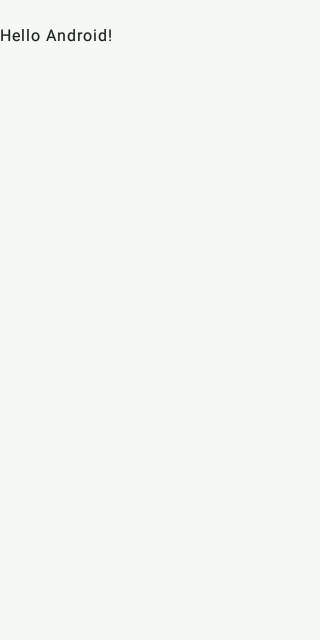
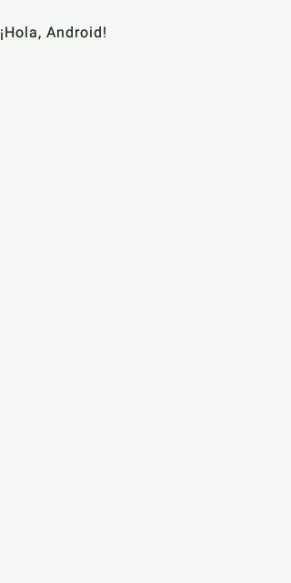
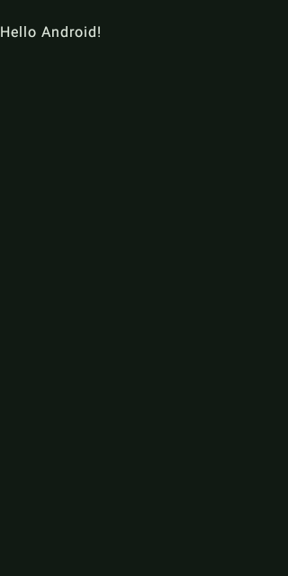
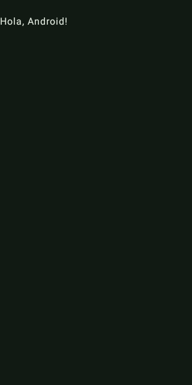
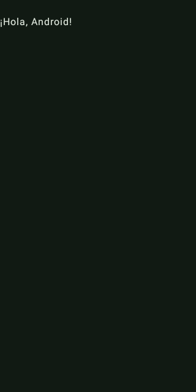

# Phase 0B starter screenshots

Captured from actual Compose UI instrumentation on the GitHub Actions API 26
`google_apis` x86_64 emulator (320 x 640 portrait) on 2026-10-09 UTC, using code
revision `0a4e77b4ffadba5d79d741d66b05702782a69cc6` and
[CI run 37966319086](https://github.com/alexbonavila/PartiturasPDF/actions/runs/37966319086).
These are unmodified PNGs reconstructed from `FoundationScreenshot` logcat
chunks in that run's `instrumentation-api26-reports` artifact. They show the
Compose root, including its inset padding; system bars are outside the capture.
Only the synthetic starter greeting is present, with no private documents.

| Mode | English | Catalan | Spanish |
| --- | --- | --- | --- |
| Light |  |  |  |
| Dark |  |  |  |

Resource contexts and explicit theme arguments exercise every variant without
changing the device's global locale. These screenshots demonstrate rendered
starter text and backgrounds; the separate activity-launch test verifies the
production entry point. They do not establish system-locale switching, landscape,
tablet/font-scale layouts, TalkBack interaction or human translation acceptance.
Those applicable manual reviews remain owner acceptance work. Future feature
screens require their own evidence; no functional UI is implemented here.
